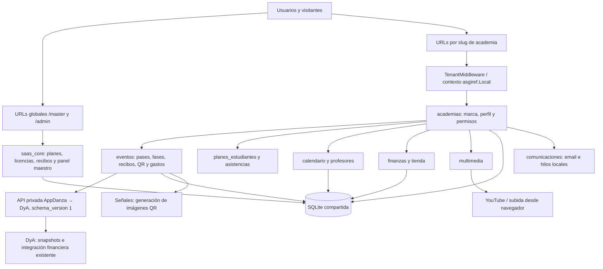
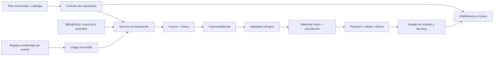
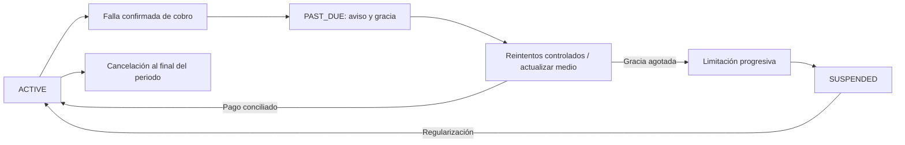
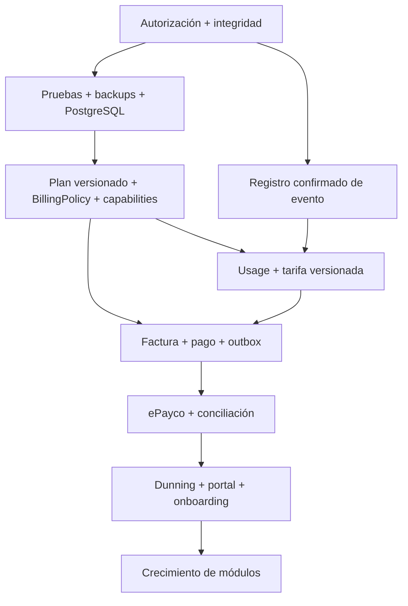

# AppDanza: revisión estratégica y técnica para su evolución a SaaS

Fecha: 28 de septiembre de 2026. Autoría: revisión técnica asistida sobre los repositorios y comprobaciones de solo lectura indicadas abajo.

## 1. Resumen ejecutivo

**AppDanza es hoy una aplicación Django con separación de datos por academia, módulos operativos reales y un esqueleto de licenciamiento SaaS. Todavía no ofrece un aislamiento de tenants suficientemente consistente para abrir el autoservicio comercial.** No requiere rehacer Bachatamanía: la evolución puede ser incremental, conservando sus identificadores, eventos, recibos, usuarios e integración con DyA.

Lo más urgente no es añadir suscripciones automáticas. Es que una identidad solo pueda operar sobre las academias y eventos autorizados. Se encontraron endpoints sin autenticación que devuelven información financiera y estudiantil, vistas que aceptan cualquier usuario autenticado sin comprobar su pertenencia al tenant, recibos públicos enumerables y permisos de colaboradores que no se aplican de manera uniforme. Algunos hallazgos se reprodujeron con llamadas internas de Django sobre producción, bajo conexión SQLite estrictamente de solo lectura.

También hay problemas comerciales concretos: se emiten entradas al crear recibos sin una verificación de pago obligatoria; las comisiones de eventos utilizan reglas incrustadas y no la tarifa configurable existente; un informe agrega dos relaciones y puede multiplicar importes; las renovaciones manuales carecen de garantías suficientes contra duplicados. Cobrar encima de estas ambigüedades generaría disputas evitables.

Hay mucho que aprovechar: academias con marca propia, planes de alumnos, asistencia, agenda y reservas, profesores y cuentas de cobro, tienda, recibos, gastos, eventos, pases, fases de preventa, descuentos, QR, panel maestro, licencias y recibos SaaS. La API privada hacia DyA tiene controles bastante más rigurosos que muchas vistas del producto y sirve como referencia de disciplina técnica.

**Recomendación:** primero autorización y exactitud transaccional; después comercialización controlada con planes explícitos; finalmente automatización de cobros y medición de registros. Separar siempre tres dominios: operaciones de la academia, obligaciones de sus clientes y facturación de AppDanza a sus tenants.

### Alcance y evidencia

- AppDanza local y producción: HEAD `94c16e9778c6ca3cc240fba08f14049d887886dc`.
- DyA terminado previamente: HEAD local/publicado/producción `4d4f924cb8c40e10844fa9347a8fca03ef798694`. La mejora de pagos presenciales quedó desplegada y configurada antes de comenzar esta revisión.
- Se leyeron modelos, vistas, formularios, permisos, middleware, URLs, servicios, señales, plantillas, pruebas, migraciones, configuración y guías de despliegue. Se inspeccionó la implementación real de ePayco de DyA.
- Las **9 pruebas existentes de AppDanza pasaron** en una base de pruebas aislada. Son las pruebas de integración con DyA; no constituyen cobertura general de seguridad, pagos o concurrencia.
- Producción se consultó mediante SQLite `mode=ro` y `PRAGMA query_only=ON`. `quick_check` devolvió `ok`. No se hicieron escrituras, cobros, migraciones, despliegues ni modificaciones de código de AppDanza.
- Se visitaron las páginas públicas de AppDanza y Bachatamanía, incluyendo viewport de 390 px. No se enviaron formularios ni se realizó un checkout.
- La base local persistente está atrasada respecto del código: falta `eventos_evento.connect_dya_finances`. No se migró. Las pruebas usaron su propia base; las comprobaciones indicadas como producción usaron la base vigente en modo de solo lectura.
- Esta es una revisión de código con verificaciones selectivas, no una prueba de penetración exhaustiva, una auditoría tributaria ni una certificación del proveedor de pagos. Las propuestas se identifican como tales; los comportamientos no ejecutados se describen como riesgos del código.

## 2. Arquitectura actual

La aplicación usa una base compartida y discriminadores `academia_id`; no hay esquemas ni bases independientes por tenant. `TenantMiddleware` resuelve la academia a partir del primer segmento de la URL y establece contexto local. `TenantManager` filtra algunos modelos usando ese contexto. Otros modelos, como los financieros, dependen de filtros explícitos. Resolver una academia en la URL **no demuestra que el usuario pertenezca a ella**.

Los puntos principales son `gestoracademia/settings.py`, `gestoracademia/middleware.py`, `gestoracademia/tenants.py`, `apps/academias/models.py:13–28`, `apps/academias/mixins.py` y `gestoracademia/urls.py`. El middleware de licenciamiento existe en `apps/saas_core/middleware.py`, pero **no está instalado** en la configuración efectiva.

### Inventario real consultado

| Elemento | Producción | Interpretación |
|---|---:|---|
| Academias | 11 | Todas con `activo=True`; no equivale a 11 clientes de pago |
| Usuarios | 32 | No implica membresías múltiples |
| Estudiantes / profesores | 16 / 1 | Módulos con datos, todavía de volumen reducido |
| Eventos | 17 | Incluye historial y estados diversos |
| Recibos de eventos / QR | 460 / 399 | Son entidades distintas; no son una misma métrica cobrable |
| Gastos de eventos | 25 | Separados del módulo financiero general |
| Recibos financieros de academia / gastos generales | 149 / 0 | La ausencia de gastos generales no significa ausencia de gastos de eventos |
| Videos | 1 | No permite inferir capacidad a escala |
| Recibos SaaS / reportes de pago SaaS | 5 / 0 | Facturación manual incipiente |
| Licencias | 8 ACTIVO / 3 SUSPENDIDO | Son estados actuales, no evidencia de cobros recurrentes |
| Migraciones aplicadas de apps propias | 68 | No se modificaron |

La base SQLite ocupa aproximadamente 1,7 MB. Producción ejecuta Django 5.2.14 con `DEBUG=False`. El tamaño actual no es un problema; la concurrencia y las garantías de integridad sí pueden serlo mucho antes de que crezca el archivo.

### Infraestructura y fronteras

Producción AppDanza está en `/home/Duane96/appdanza`, con virtualenv `/home/Duane96/.virtualenvs/appdanzaenv`. DyA usa otro proyecto y entorno. La guía vigente contempla un supervisor para procesos de DyA y el pull de AppDanza cada 300 segundos; no debe suponerse que hay capacidad gratuita ilimitada para añadir workers de facturación. El roadmap debe reservar recursos y ownership de cada proceso sin perturbar esa integración.

## 3. Multi-tenancy

Las etiquetas siguientes expresan severidad técnica del control examinado, no una valoración general del producto.

| Estado | Control / hallazgo | Evidencia y consecuencia |
|---|---|---|
| SEGURO | API privada de DyA cerrada por defecto | Token constante, HTTPS, GET, ámbito explícito, sin PII y pruebas en `apps/eventos/dya_api.py` y `test_dya_api.py`. Seguridad referida a ese contrato concreto |
| SEGURO | Vistas que usan `TenantAdminRequiredMixin` y búsquedas filtradas | Ejemplos en finanzas, POS y administración de estudiantes. El patrón es reutilizable; no cubre todas las vistas |
| MEJORABLE | Claves de tenant y unicidades parciales | `TenantModel`, slug por academia y documento por academia ayudan, pero no garantizan que todos los FK relacionados pertenezcan al mismo tenant |
| RIESGO | Manager que devuelve todo sin contexto | `apps/academias/models.py:13`: ausencia de tenant implica queryset global. Un job, comando o vista fuera del middleware puede omitir el aislamiento accidentalmente |
| RIESGO | Autenticación sin pertenencia | Numerosas vistas de eventos y multimedia usan solo `LoginRequiredMixin`. El queryset sigue el slug, no la membresía del usuario |
| RIESGO | APIs sin autenticación | `apps/saas_core/views.py:56` y `apps/planes_estudiantes/views.py:279`: finanzas por academia y detalle estudiantil |
| RIESGO | Referencias cruzadas | `CodigoDescuentoForm.pase_aplicable` tiene queryset global; inscripción, sesión, profesor y precios de fases también necesitan validación consistente del tenant de ambos extremos |
| MEJORABLE | Modelo de usuario único por academia | `PerfilUsuario` es OneToOne con User y tiene un solo FK Academia; no representa una persona administrando dos academias con roles diferentes |
| RIESGO | Colaboradores de eventos sin autorización efectiva uniforme | `ColaboradorEvento` define METRICAS/TAQUILLA, pero se usa principalmente en login/admin; las vistas de eventos no aplican sistemáticamente esos permisos |
| RIESGO | Admin Django global | ModelAdmin convencionales y URL global sin tenant. Puede ser correcto para superadmin, pero sería peligroso otorgar `is_staff` y permisos de modelos a un administrador de academia |
| MEJORABLE | Limpieza del contexto | El middleware limpia el contexto al finalizar normalmente, pero no usa `try/finally`. Debe garantizar limpieza incluso ante excepciones |

### Comprobaciones de solo lectura sobre producción

Con `RequestFactory`, sobre la base real abierta en modo de solo lectura:

1. `api_finanzas_academia` aceptó `AnonymousUser` y devolvió **200** para una academia existente.
2. `api_detalle_estudiante` aceptó `AnonymousUser` y devolvió **200** para un estudiante existente. El código serializa nombre, teléfono, correo, QR, planes y asistencia.
3. `EventoUpdateView` aceptó una identidad autenticada sintética, no staff y sin membresía en la academia, y devolvió **200** para el formulario de un evento ajeno. No se envió POST.
4. `RegistroExitoView` aceptó un visitante anónimo con un ID de recibo existente y devolvió **200**. El código expone los datos del recibo y entradas.
5. El queryset de `pase_aplicable` no tenía filtro WHERE.

Son reproducciones internas de autorización de Django; no se afirma haber explotado esos endpoints a través de la red pública ni haber alterado datos. Una protección eventual del proxy no reemplaza la autorización de la aplicación.

### Arquitectura recomendada

Introducir un contexto de tenant explícito y un servicio de autorización común: identidad, tenant, acción y recurso. Denegar por defecto. Usar managers globales únicamente en código de plataforma claramente identificado. La protección debe existir también en servicios y formularios, no solo en menús o middleware.

Como evolución aditiva, crear `Membership(user, tenant, role, status)` con unicidad por usuario/tenant, y permisos concretos para propietarios, administradores, profesores, estudiantes y colaboradores. Mantener `is_superuser` como privilegio de plataforma, separado de roles de academia. Un organizador obtiene un workspace aunque no opere una escuela. Los colaboradores conservan acceso limitado a eventos específicos.

No empezar por reemplazar todos los perfiles. Primero cerrar las rutas actuales usando el modelo existente, crear pruebas con dos tenants y luego migrar membresías. Probar lectura, escritura, exportación, archivos, API, búsqueda y acceso por ID en cada frontera.

## 4. Módulos actuales

| Módulo | Qué hace hoy | Límites relevantes |
|---|---|---|
| `academias` | Tenant, marca, landing, login, perfil y mixins | Una academia por perfil; credenciales de pasarelas en campos de texto; permisos inconsistentes fuera del módulo |
| `saas_core` | Planes, licencias, panel maestro, renovaciones, recibos/gastos SaaS, leads y landing | Cobro manual; no motor de facturación, intentos ni ledger de uso |
| `planes_estudiantes` | Planes académicos, estudiantes, inscripciones, portal | Estudiante no enlazado de forma inequívoca con User; búsquedas por nombre/correo; API abierta |
| `asistencias` | Marcación por QR y manual, consumo de clases | No enlaza claramente asistencia con sesión/reserva; carreras al descontar cupos/clases |
| `calendario` | Clases, sesiones, recurrencias, reservas y cancelaciones | Capacidad y débito de clases requieren transacción coherente; cancelación no conserva referencia al débito original |
| `profesores` | Docentes, tarifas, cuentas mensuales y pago | Crea/modifica órdenes durante GET; falta unicidad por periodo y defensa contra doble pago concurrente |
| `finanzas` | Recibos, gastos, anulaciones y exportación | No cuentas, transferencias, saldos iniciales ni cierres; no integra completamente finanzas de eventos |
| `tienda` | Productos, categorías, inventario, POS y venta enlazada a recibo | Buenas validaciones en POS; hooks y concurrencia necesitan consolidación; sin idempotencia por operación |
| `eventos` | Evento, pases, preventa, descuentos, recibos, QR, entrada, gastos y colaboradores | Es el dominio más completo y también concentra pago, entrada, pricing, imágenes y email dentro de vistas/señales |
| `multimedia` | Módulos, videos de YouTube y subida desde navegador | Acceso insuficiente, OAuth parcialmente implementado y sin gestión durable de credenciales por tenant |
| `comunicaciones` | Envíos email reutilizables | Hilos de proceso, sin outbox, reintentos, preferencias ni historial de entrega |

### Eventos: entidades que no deben confundirse

`Evento` es el contenedor; `TipoPase` describe el producto; `FasePreventa` y `PrecioFasePase` describen precios temporales; `ReciboEvento` registra una operación y datos del comprador; `EntradaQR` es una credencial de acceso; `GastoEvento` es un egreso. `cantidad_entradas`, `qrs_por_pase` y `accesos_permitidos` son tres magnitudes diferentes. Ni los escaneos ni los QR son automáticamente ventas facturables.

No existe una entidad robusta de participante nominativo, devolución monetaria, pago confirmado independiente del recibo, promotor con liquidación o registro de cada check-in. `ColaboradorEvento` no sustituye esos conceptos.

## 5. Deuda técnica

1. **Autorización dispersa.** Se mezclan managers implícitos, filtros explícitos, login, roles y contexto URL. Corregir primero el patrón común y luego inventariar todas las rutas. No basta con cambiar un middleware.
2. **Estados con significados ambiguos.** `ReciboEvento.revisado_por_admin` tiene default verdadero; el recibo genera QR al guardarse. Un formulario manual público puede producir acceso sin una aprobación administrativa explícita. `anulado` no demuestra que se haya devuelto dinero.
3. **Cálculos financieros incorrectos.** `api_finanzas_academia` agrega ingresos y gastos de eventos en el mismo join. La comparación de esa forma de consulta contra sumas independientes produjo discrepancias en los eventos **2, 3, 9 y 12**. Corregir mediante subconsultas o agregaciones separadas; `distinct` sobre importes no es una solución porque dos ventas legítimas pueden tener el mismo valor. La documentación de Django advierte sobre este efecto al [combinar agregaciones](https://docs.djangoproject.com/en/5.2/topics/db/aggregation/#combining-multiple-aggregations).
4. **Dinero y comisiones con reglas incrustadas.** `Evento.calcular_estado_comisiones` usa 5.000 COP por persona online y mínimo de 100.000 COP para Colombia; en otros países usa 5% con float y rotulación USD, incluso cuando la academia puede utilizar otra moneda. No consume `comision_por_tiquete`. La rama internacional no excluye anulados de forma consistente. Son reglas existentes, no precios recomendados.
5. **Concurrencia e idempotencia insuficientes.** Numeraciones por count/último ID, cuotas de cupones, consumo de QR, reservas, aprobación SaaS y pagos docentes pueden duplicarse o exceder límites. Una transacción sin restricciones ni bloqueos efectivos no resuelve todos esos casos.
6. **Efectos secundarios ocultos.** Guardar recibos genera QR; guardar detalles cambia stock; un GET del profesor genera o elimina órdenes. Es difícil razonar, reintentar y auditar estas operaciones.
7. **Código duplicado o contradictorio.** Dos propiedades `modulo_eventos_activo` en SuscripcionAcademia; dos `ListaModulosAdmin`; `form_valid` duplicado en configuración de academia; dos `__init__` en un formulario de tienda. Python utiliza la última definición y oculta la anterior.
8. **Excepciones silenciadas.** Numerosos `except` amplios ocultan fallos de correo, imágenes, rutas o cálculos. Registrar errores estructurados sin PII y presentar estados recuperables.
9. **Entorno poco reproducible.** `requirements.txt` no declara directamente varias dependencias importadas en ejecución, como python-dotenv, xhtml2pdf y reportlab. Que estén instaladas actualmente no garantiza una reconstrucción limpia. Los comentarios de versión también están desactualizados.
10. **Pruebas concentradas en un solo contrato.** Las 9 pruebas cubren DyA; los otros archivos de tests son principalmente scaffolding. Priorizar pruebas de autorización y transiciones financieras, no tests que solo repitan el código.

## 6. Funcionalidad a eliminar/deprecar

**FUNCIONALIDAD QUE CONVIENE ELIMINAR O DEPRECAR**, siempre con migración o reemplazo previo:

| Elemento y evidencia | Por qué / reemplazo | Riesgo al retirarlo |
|---|---|---|
| Definiciones duplicadas de propiedades, vistas y métodos citadas en §5 | Conservar una implementación explícita con pruebas del comportamiento actual | Bajo en datos, medio en comportamiento: la primera definición ya no se ejecuta, pero puede representar una intención perdida |
| Precios legacy `precio_preventa`, `precio_puerta`, `precio_por_dia` y fallback FULL/DIA en eventos | Consolidar catálogo de pases y precios por fase | Alto: aún hay ramas que los usan. Inventariar eventos/recibos legacy y mantener lectura histórica antes de retirar campos |
| Cálculo de comisiones dentro de Evento con constantes por país | Sustituir por política versionada, usage y cargos SaaS | Alto: conservar deudas históricas y explicar diferencias; no recalcular retroactivamente todo |
| `tarjeta_respaldo_configurada` como indicador suficiente de medio válido | Usar referencia a PaymentMethod tokenizado y estado confirmado | Medio: un booleano no acredita tarjeta tokenizada, consentimiento ni posibilidad de cobrar |
| Opción de tarjeta cuyo backend responde «en desarrollo» | Ocultar hasta tener integración certificada o marcar claramente como no disponible | Bajo; evita una promesa de checkout que hoy no se puede completar |
| Callback OAuth que muestra éxito sin completar intercambio en `multimedia/views.py:113` | Implementación única coherente con el flujo de subida realmente soportado | Medio; no retirar el flujo directo GIS que sí usa el navegador sin mapear antes consumidores |
| Ramas de anulación que buscan `boletas`/`entradas`, mientras la relación real es `boletas_qr` | Un servicio explícito de revocación de acceso y anulación | Medio; actualmente el scanner comprueba el recibo anulado, por lo que no se debe describir esto como revocación totalmente ausente |
| Métricas comerciales fijas «+50 Academias», «+10k Tickets», «0 Filas» en landing | Sustituir por cifras verificables o beneficios sin cifras | Bajo; no están respaldadas por el inventario consultado y pueden inducir a error al vender |
| Generación de documentos y envío de comunicaciones como efectos implícitos de save | Comandos de dominio + outbox + jobs idempotentes | Alto si se retira abruptamente: preservar emisión y reintentos durante transición |

**No conviene eliminar** Bachatamanía, su landing especializada de Master League, los recibos existentes, los modelos financieros de academia ni la API privada de DyA. Las particularidades de un evento deben aislarse como configuración/extensión; su existencia no justifica borrar una función utilizada. Tampoco se propone reemplazar Django ni introducir Kubernetes.

## 7. Funcionalidad a mejorar

**FUNCIONALIDAD EXISTENTE QUE CONVIENE MEJORAR**, por dominio:

- **Academias y usuarios:** autorización común; invitaciones y restablecimiento de contraseña; vínculo inequívoco estudiante/usuario; posterior membresía múltiple. No usar documento como contraseña inicial permanente. Diferenciar administrador de tenant de staff global.
- **Eventos:** separar servicios de catálogo/precios, pedidos, pagos, emisión, check-in y comisiones. Validar pase activo, fase y descuento del mismo evento; cantidad mínima/máxima en servidor; idempotencia real. No abrir una ruta de venta de puerta cuando el evento esté FINALIZADO. Cambios de estado mediante POST con CSRF y política de permisos.
- **Recibos y QR:** diferenciar pendiente, confirmado, anulado y reembolsado; enlazar participante/entitlement con credenciales reemplazables. Un QR reemitido no crea otra venta. Check-in atómico y registro de cada uso, con regla por día/sesión cuando corresponda.
- **Descuentos:** consumir cupos atómicamente y guardar la regla aplicada como snapshot. Actualmente un descuento inválido puede terminar ignorado y cobrarse el precio normal; la interfaz debe explicar el resultado antes de confirmar.
- **Finanzas:** corregir sumas y separar vistas de caja, ingreso, saldo por cobrar y venta. Diseñar cuentas y ledger antes de añadir cierres. Anular una transacción no debería borrar una inscripción y su historia (`finanzas/views.py:138`).
- **Asistencia/reservas:** una única política de consumo de clases. Conservar qué inscripción financió una reserva para revertir exactamente ese débito; evitar consumir otra vez al marcar asistencia. Proteger cupo y saldo con transacción y restricciones.
- **Profesores:** generación explícita de cuentas, unicidad por profesor/periodo y pago idempotente. GET debe limitarse a leer. Mantener ajustes y aprobación trazables.
- **Tienda:** preservar snapshots de precio/costo y vínculo con recibo; consolidar stock en movimientos consistentes; idempotencia de venta y anulación. PostgreSQL hará efectivos los bloqueos que SQLite no ofrece.
- **Multimedia:** cerrar accesos antes de ampliar funciones; distinguir preview público de material restringido; permisos por curso/plan; credenciales YouTube por tenant solo cuando el caso lo necesite. El último video no debe aparecer en landing sin decisión explícita de publicación.
- **Comunicaciones:** outbox persistente, reintentos, estado de entrega, plantillas por tenant, consentimiento y preferencias. Email primero; WhatsApp después de medir demanda y coste.
- **SaaS:** una sola transición de renovación/aprobación con idempotencia; separar licencia de deuda, uso y factura. Prohibir que un reporte de pago arbitrario elija otro tenant mediante POST.

### UX desktop y móvil

Las landings públicas visitadas no tuvieron desbordamiento horizontal de documento a 390 px: aproximadamente 387 px en AppDanza y 375 px en Bachatamanía. La navegación colapsable y varias tablas responsive son buenos puntos de partida. La marca por academia ya tiene espacio en el diseño.

En Bachatamanía el hero ocupa casi toda la primera pantalla móvil y empuja la acción principal hacia abajo. La landing global usa tarjetas/ticker repetidos deliberadamente en plantilla: no son registros duplicados, pero necesitan semántica accesible y respeto a movimiento reducido. El modal «Crear mi Plataforma» es en realidad un formulario de contacto, no onboarding automático; conviene que la promesa sea clara.

En el código administrativo abundan tablas anchas, modales largos, scroll interno y listados sin paginación. Deben probarse con teléfono real, teclado abierto, errores de validación y lectores de pantalla. No se ejecutó un smoke completo de paneles autenticados; algunas vistas GET tienen escrituras, por lo que no era compatible con esta misión de solo lectura.

Para alumno y organizador: una acción principal por pantalla, precio y estado de pago inequívocos, comprobante fácil de subir, QR recuperable sin exponer PII, y estados de aprobación visibles. El checkout actual duplica parte del cálculo entre JavaScript y servidor; debe existir una cotización autoritativa compartida. Las finanzas y operación de acceso no deben depender de que el usuario interprete una etiqueta ambigua.

## 8. Funcionalidad a añadir

**FUNCIONALIDAD NUEVA RECOMENDADA**, sin convertir el roadmap en un catálogo indiscriminado:

| Prioridad | Bloque | Valor práctico y alcance |
|---|---|---|
| P0 | Autorización común y auditoría de operaciones críticas | Vender sin exponer otra academia ni perder trazabilidad; no es un nuevo panel decorativo |
| P0 | Confirmación de pago e idempotencia de registros | Saber qué se vendió, qué se pagó y qué acceso se emitió |
| P1 | Membresías, invitaciones y onboarding | Una persona puede trabajar en varias academias; altas sin contraseñas predecibles |
| P1 | Billing, capabilities y portal de plan | Cobrar de manera explícita, explicar límites y recuperar impagos |
| P1 | Renovaciones y recordatorios de alumnos | Alta utilidad recurrente para academias; aprovechar planes existentes |
| P1 | Outbox y worker de tareas fiables | Base para correo, facturación y emisión sin bloquear requests |
| P2 | Finanzas de academia con cuentas y cierres | Requiere ledger y política de correcciones; útil como módulo comercial opcional |
| P2 | Niveles, progresión y agenda operativa más sólida | Extender estudiantes/sesiones; añadir clases privadas y alquileres cuando exista demanda medible |
| P2 | CRM sencillo de leads y seguimiento | Primero persistir el lead actual y su estado; después campañas/WhatsApp con consentimiento |
| P2 | Promotores/afiliados y liquidaciones de eventos | Solo con atribución y base económica verificables; no reutilizar cupones como contabilidad |
| P2 | Reportes y marca/dominio personalizado | Consolidar datos antes de añadir dashboards o white label avanzado |
| P3 | Evaluaciones, certificados y competencias | Productos específicos, no necesarios para la primera academia comercial |
| P3 | Recomendaciones inteligentes, transcripción y ASR | Costes, derechos, almacenamiento y aislamiento adicionales; no portarlos de DyA como requisito inicial |

Asistencia, horarios, profesores, nómina básica, multimedia y QR **ya existen parcialmente**. Su primer paso es mejorar consistencia, no crear módulos paralelos con el mismo propósito. Push móvil y automatización avanzada deben esperar evidencia de uso; email transaccional fiable ofrece valor antes.

## 9. Comparación con DyA

| Aprendizaje real de DyA | Aplicación a AppDanza | Lo que no debe copiarse sin más |
|---|---|---|
| `CuentaFinanciera`, cierres y auditoría (`administracion/models.py:432,648,1255`) | Separar cuenta, movimiento, cierre y corrección; proteger periodos cerrados | Distribuciones de socios, reglas de Disponible y acuerdos internos específicos de DyA |
| `financial_control.py:22` y correcciones controladas | Guardas transversales y trazabilidad de ajustes | Sus cortes históricos y excepciones particulares |
| Cuenta principal e instrucciones públicas recién desplegadas | Destino visible configurable, texto flexible y sin efecto contable al seleccionarlo | Duplicar cuentas o asumir que el destino mostrado crea un ingreso |
| Webhooks ePayco y activación idempotente | Adaptador de proveedor, validación, deduplicación y estados | `PagoVirtual`, cursos, usuarios y activación de acceso acoplados a DyA |
| Cliente AppDanza y sincronización por snapshots | Contratos explícitos, validación de importes y retención del último snapshot válido | Convertir toda AppDanza en una extensión financiera de DyA |
| Videoteca, worker y enlaces al reproductor existente | Reusar UX coherente, colas con estados y autorizaciones | Importar ASR, credenciales o contenido de DyA como valores globales SaaS |
| Pago móvil claro y genérico | Mostrar cuenta + instrucciones + estado y comprobante | Hardcodear Duane, Aleja o una entidad bancaria para todos los tenants |

El producto SaaS debe tener sus propios servicios y políticas. DyA sirve como referencia de problemas ya aprendidos, no como plantilla de negocio. La integración actual es un cliente específico de AppDanza y debe seguir funcionando aunque se añadan otros tenants y planes.

## 10. SaaS plans architecture

### Qué reutilizar y qué falta

| Concepto | Base actual | Evolución propuesta |
|---|---|---|
| Tenant / workspace | `Academia` | Conservar identidad; añadir tipo ACADEMY / EVENT_ORGANIZER / INTERNAL sin exigir alumnos o escuela a un organizador |
| Plan | `PlanSaaS` | Versiones inmutables de precio y capabilities; distinguir catálogo comercial de contratos ya aceptados |
| Subscription | `SuscripcionAcademia` OneToOne | Historial de periodos, fechas efectivas, cancelación al cierre, estado del proveedor y cambios programados |
| Billing account | No entidad completa | Datos de facturación del cliente AppDanza, moneda, zona horaria, país, referencias del proveedor y política de exención |
| Feature / limit | Booleanos de plan y `max_estudiantes` | Catálogo de capabilities tipadas, límites, overrides y fuente del derecho |
| Usage | No ledger SaaS | Hechos inmutables, claves de deduplicación y agregados reconstruibles |
| Invoice / InvoiceLine | `ReciboSaaS` es comprobante de ingreso, no cuenta por cobrar | Factura/cuenta comercial con periodo, vencimiento, moneda y líneas con snapshots |
| Payment / PaymentAttempt | Reporte manual y recibo | Pago económico separado de intentos de cobro; múltiples intentos pueden corresponder a una misma obligación |
| Credit / Refund | Sin dominio completo | Crédito reduce deuda; refund devuelve un pago. Son operaciones distintas |
| BillingCycle | Fechas de vencimiento simples | Puede empezar como periodo en Subscription/Invoice; no hace falta una tabla independiente sin necesidad real |
| Audit / outbox | Parcial y disperso | Eventos de dominio y entrega durable, con actor, razón, correlación y timestamps |

No crear todos los modelos por similitud con una lista. El mínimo coherente es: política de billing, plan versionado, contrato de suscripción, factura con líneas, intento/pago, evento de proveedor y outbox. Usage y tarifas son necesarios cuando se ofrezca cobro por evento. El recibo SaaS existente puede mantenerse como comprobante asociado al pago y para el historial legado.

### Límites de responsabilidad

Las finanzas de una academia no entran en ese ledger como ingresos de AppDanza. Un tenant puede vender diez millones y deber a AppDanza únicamente su suscripción y fees acordados.

### Planes conceptuales, sin precios definitivos

- **Básico:** operación esencial de alumnos, planes, asistencia y agenda; límites moderados de estudiantes activos, profesores y almacenamiento. Seguridad, exportación de datos propios y recuperación de cuenta no deben ser características premium.
- **Academia:** más capacidad, profesores, reportes, reservas y finanzas operativas. La profundidad contable debe corresponder a lo realmente implementado y probado.
- **Pro:** automatizaciones, comunicaciones, reportes avanzados, mayor almacenamiento y opciones de marca. Soporte y SLA pueden diferenciarse sin comprometer aislamiento o backups básicos.
- **Evento:** contrato por uso/campaña para organizadores; no necesita incluir módulos escolares. QR y registro son funciones centrales, no añadidos inesperados al final del checkout.

Versionar el plan contratado: cambiar el catálogo mañana no debe alterar silenciosamente una obligación ya emitida. Los cambios de plan necesitan fecha efectiva y política explícita de prorrateo; para la primera versión es razonable programarlos al siguiente periodo y evitar prorrateos complejos.

### Moneda, país e impuestos

Academia ya tiene `pais` y `divisa`, pero las cantidades de muchos módulos no guardan moneda propia y algunas rutinas asumen COP o devuelven USD. Cambiar el país de una academia no debe reinterpretar ventas históricas. El dominio SaaS necesita moneda en precio, factura, línea, pago, crédito y refund; precisión por moneda y Decimal en cálculos; el cambio de moneda debe ser una operación explícita.

Preparar país de facturación, identificación fiscal, dirección, naturaleza de línea, base, impuesto y total como snapshots. No se propone implementar impuestos, facturación electrónica ni requisitos tributarios en esta misión. Tampoco presentar un PDF interno como comprobante fiscal válido por defecto. Antes de comercializar en otro país hay que confirmar proveedor, monedas y obligaciones aplicables con asesoría competente.

## 11. Billing ePayco

### ePayco SaaS Billing: implementación real de DyA

DyA implementa un **checkout de pago único**, no un motor completo de suscripciones ePayco. La evidencia principal está en:

- `virtual/services/epayco.py`: configuración, autenticación, creación de sesión, firma y fingerprint.
- `virtual/services/epayco_confirmation.py`: validación de confirmaciones y transiciones.
- `virtual/services/billing.py:30`: activación de acceso virtual.
- `virtual/views.py:319,376,388`: checkout, retorno y webhook.
- `steam/settings.py:303–328`: configuración mediante entorno.

Usa `EPAYCO_PUBLIC_KEY`, `EPAYCO_PRIVATE_KEY`, `EPAYCO_CUSTOMER_ID`, `EPAYCO_P_KEY`, `EPAYCO_TEST`, `EPAYCO_LIVE_ENABLED`, `EPAYCO_HTTP_TIMEOUT`, `EPAYCO_MERCHANT_NAME` y `PUBLIC_BASE_URL`. **No se leyeron ni reprodujeron valores de credenciales.** La configuración distingue test/live y necesita habilitación explícita de cobro real.

El adaptador obtiene un Bearer mediante `/login` y crea una sesión en `/payment/session/create`. Genera una referencia EPV única, transmite importe/moneda, URLs de respuesta y confirmación, y solicita `uniqueTransactionPerBill`. El retorno del navegador no activa el acceso. La confirmación valida comercio, firma SHA-256 según el protocolo, modo, importe Decimal, moneda y correspondencia de referencias; guarda una selección limitada del payload y usa fingerprint, referencias únicas y transacción para deduplicar.

Los estados del proveedor se traducen a aprobado, rechazado, pendiente, fallido, revisión o cancelado. Una confirmación tardía de fallo no deshace un aprobado. Algunos estados se envían a revisión: no equivalen a un sistema completo de refunds o disputas. La activación está acoplada a compra de acceso virtual, usuario y reglas financieras de DyA. El código actual no crea una suscripción ePayco con un medio tokenizado; una bandera de recurrencia o un flujo PayPal legado no cambia ese hecho.

### Qué reutilizar

Reutilizar el diseño de un adaptador pequeño, validación estricta del webhook, separación retorno/confirmación, whitelist de datos, referencias únicas, idempotencia y tratamiento de eventos fuera de orden. Extraerlo conceptualmente hacia una interfaz de proveedor: crear intento, consultar estado, verificar notificación y normalizar resultado.

No copiar directamente `PagoVirtual`, la activación de cursos, estados particulares de acceso ni reglas de cierres de DyA. AppDanza necesita activar un contrato de tenant y liquidar una factura, sin crear compras virtuales de DyA. La verificación criptográfica debe seguir exactamente el contrato del producto ePayco elegido; los campos firmados no sustituyen una conciliación independiente de importe y estado con el proveedor.

### Recurrente y tokenización: qué está documentado

El [SDK oficial Python de ePayco](https://github.com/epayco/epayco-python) documenta tokenización, clientes, planes y creación/consulta/cancelación de suscripciones, con intervalos, moneda, prueba y URL de confirmación. La [página oficial de suscripciones](https://epayco.com/suscripciones/) presenta cobros periódicos y tokenización de tarjetas. Esto prueba que existe oferta del proveedor; **no demuestra que la cuenta comercial actual tenga habilitado ese producto, ni que cualquier método de pago soporte renovación automática**.

La documentación web de referencia no pudo abrirse satisfactoriamente durante esta revisión. Antes de implementar se deben confirmar versión de API, producto contratado, endpoints, reglas de reintento, cancelación, devolución, firma de eventos y capacidades de la cuenta en sandbox. No se probaron credenciales ni se hicieron llamadas de cobro.

### Credenciales y separación contable

No asumir que las credenciales de DyA son correctas para AppDanza por pertenecer ambos repositorios al mismo propietario. Puede ser técnicamente posible operar varios productos bajo un mismo comercio si el proveedor y el contrato lo permiten, pero eso no responde quién factura, quién recibe fondos, qué descriptor ve el cliente y cómo se concilian devoluciones, comisiones y disputas.

**Recomendación:** configuración de merchant para AppDanza separada de DyA, incluso si finalmente la entidad jurídica y el contrato permiten compartir una cuenta comercial. Aislar secretos, referencias, endpoints, ambiente y conciliación por aplicación; preferir credenciales/subcuenta separadas si el proveedor lo admite. La decisión final depende del contrato comercial y del responsable contable, no de una suposición técnica.

Además, diferenciar dos relaciones: **AppDanza cobra a la academia** por SaaS; **la academia cobra a sus alumnos/compradores** por clases o eventos. No usar por defecto el merchant de AppDanza para recaudar ventas de todas las academias. Eso convertiría el problema en recaudo de terceros y liquidaciones, con obligaciones adicionales. El primer modelo comercial puede dejar esos pagos en las cuentas de cada academia y facturar solo los servicios de AppDanza.

### Flujo propuesto

1. Crear BillingAccount y contrato con precio/moneda/periodo aceptados; registrar consentimiento y política de renovación.
2. Capturar el medio mediante componente/tokenización soportados por el proveedor. El backend conserva referencias opacas y datos mínimos permitidos; nunca PAN o CVV en DB, logs o formularios propios persistentes.
3. Elegir **un solo responsable de programar el cobro**: suscripción administrada por ePayco o cobros programados por AppDanza sobre token autorizado. No activar ambos para la misma obligación.
4. Crear factura con clave única de contrato/periodo, y un intento con clave de idempotencia estable. Un timeout queda en estado UNKNOWN/PENDING y se consulta antes de volver a cobrar.
5. Recibir webhook en una inbox persistente; validar autenticidad y referencias. Deduplicar por identificador del proveedor y fingerprint apropiado. Responder con rapidez y procesar estados de manera monotónica o con transiciones permitidas.
6. Conciliar con consulta al proveedor los intentos pendientes, ambiguos o eventos que no llegaron. Registrar importe bruto, comisión del proveedor y neto por separado cuando corresponda.
7. Liquidar factura y renovar derecho una sola vez. El mismo webhook repetido no crea otro recibo, periodo ni movimiento.
8. Cancelar al final del periodo o de inmediato según contrato; distinguir cancelación, crédito, devolución monetaria y disputa. Un refund no borra factura ni historial.

La suite mínima incluye firma inválida, importe/moneda/comercio incorrectos, duplicados, orden invertido, timeout seguido de aprobación, doble job mensual, factura parcialmente pagada si se permite, cancelación y conciliación. Solo después de sandbox y revisión comercial se habilitaría live.

## 12. Usage billing de eventos

### Event Registration Billing: qué se puede contar hoy

En producción existen 460 recibos y 399 QR. Entre los recibos hay 294 online y 145 de puerta no anulados; 14 online y 7 de puerta anulados. Todos tienen `revisado_por_admin=True`, y hay dos recibos de importe cero. **Estos datos no prueban 439 registros cobrables ni permiten convertir los 399 QR directamente en usage facturable.** Un recibo puede contener varios pases; un pase puede generar varios QR; un acceso puede permitir varios ingresos.

El campo revisado no ofrece hoy evidencia fuerte de pago porque su valor predeterminado es verdadero y el comprobante del formulario público es opcional en servidor, aunque el HTML lo muestre requerido. Tampoco existe una devolución monetaria independiente que permita inferir qué anulación devolvió dinero. No se debe facturar retroactivamente a partir de esos supuestos.

### Métrica recomendada

Definir contractualmente **registro confirmado de participante/admisión** como unidad comercial: un derecho de participación emitido a raíz de una operación válida y confirmada. Es independiente de la imagen QR, del número de escaneos y de reemisiones. Para un pase de pareja, decidir explícitamente si se venden dos admisiones; para un congreso de varios días, una admisión puede tener varios accesos sin multiplicar el fee.

El hecho cobrable nace al confirmar la operación y otorgar el derecho, no al crear un borrador de recibo. Guardar `source_registration_id`, tenant, evento, instante, cantidad comercial, tipo, importe/moneda de base, origen, motivo y clave única. Si por la arquitectura inicial la fuente sigue siendo ReciboEvento, introducir una transición de confirmación y un identificador estable de cada unidad; no usar simplemente post_save del QR.

| Caso | Tratamiento propuesto, sujeto a contrato |
|---|---|
| Pago confirmado y acceso emitido | Genera usage una vez |
| Pendiente / comprobante sin aprobar | No facturable todavía |
| Cortesía, invitación o descuento 100% | Usage operativo medible, normalmente no cobrable; política explícita, nunca inferida solo por total cero |
| Descuento parcial | Fee fijo por admisión o porcentaje sobre base neta acordada; guardar snapshot |
| Venta de puerta | Definir si usa el servicio facturable; no asumir que siempre es gratis porque el código actual lo hace |
| Pase doble / pareja | Dos admisiones solo si esa es la unidad contractual; no depende de cambiar `qrs_por_pase` después |
| Pase multiday | Una inscripción con varios accesos; escanear varios días no crea ventas nuevas |
| QR reemitido o comprador que reenvía formulario | Misma inscripción, sin doble uso facturable |
| Anulación antes de confirmación | Sin cargo |
| Refund tras confirmación | Evento compensatorio y crédito según política; preservar cargo original |
| Anulación administrativa sin devolución | Revoca acceso, pero no prueba devolución ni crédito SaaS automático |
| Importación histórica / evento externo | No cobrar retroactivamente por defecto; marcar fuente y exclusión o acuerdo explícito |

### Tarifa, precedencia y snapshot

Proponer `EventFeePolicy` versionada con moneda, componente fijo, porcentaje Decimal, base del porcentaje, mínimos/topes si se contratan y periodo de vigencia. Resolver: **exención interna → override de evento → override de tenant → acuerdo del plan → tarifa global**. Una exención central siempre domina; un override no puede reactivar cobros accidentalmente sobre Bachatamanía.

Para cada hecho aceptado guardar la política resuelta y su versión. Fórmula conceptual: `cargo = unidades × fijo + base_elegible × porcentaje`, con redondeo definido por moneda. Un cambio futuro de tarifa o de pase no reescribe cargos anteriores. No fijar cantidades ni mínimos definitivos en el código.

### Ledger, cierre y facturación

Mantener un ledger SaaS separado con hechos de uso, cargos, créditos y vínculo a líneas de factura. Unicidad por fuente/tipo/versión de evento impide duplicados; correcciones son nuevas entradas compensatorias, no sobrescrituras. Los agregados de dashboard son derivados y reconstruibles.

En cierre mensual, seleccionar hechos elegibles no facturados hasta el corte, agrupar por contrato/evento/política/moneda y crear factura idempotente. La zona horaria y el tratamiento de eventos tardíos deben estar documentados; una corrección posterior produce crédito o cargo en periodo siguiente. Para un organizador ocasional puede existir liquidación al terminar el evento, sin suscripción mensual.

La academia debe poder descargar el detalle de cada registro facturado y disputar una línea. AppDanza necesita evidencia de confirmación y ajuste, no solo una cifra agregada. Los refunds del comprador y los créditos del fee SaaS son decisiones relacionadas pero separadas: el contrato debe decir si el fee se devuelve, total o parcialmente.

## 13. Tenant interno Bachatamanía

**Ya existe una base válida para la exención.** En producción Bachatamanía tiene `es_cuenta_partner_gratis=True`, comisión configurable cero y licencia ACTIVO. Está marcada como academia de solo eventos, con moneda COP. Por tanto, no hay que inventar un condicional de billing por ID.

Existe un recibo SaaS histórico de importe **0,00**, `SAAS-0001`, asociado a una reactivación de 30 días del Plan Eventos. Es historial, no una deuda ni evidencia de un cobro real. Debe conservarse; no hace falta borrarlo para implementar una política mejor.

Evolución propuesta: `BillingPolicy` central con `billing_exempt`, motivo INTERNAL, vigencia y actor que lo autorizó. Traducir el flag actual a esa política mediante migración aditiva y compatible. Separar exención de derechos funcionales: un tenant interno puede tener un paquete de capabilities explícito sin depender de hacks repartidos en cada propiedad.

Resultado contractual:

- Tipo: **tenant interno**.
- Suscripción: **$0**.
- Event fee: **$0**.
- Cobros automáticos, dunning y generación de obligaciones SaaS: **exentos**.
- Uso operativo: medible para capacidad y soporte, sin convertirlo en ingresos ni MRR.
- Historial y operación: conservados; la exención no borra datos ni altera las finanzas de DyA.

Evitar emitir facturas de deuda o intentar cargar una tarjeta para un tenant exento. El motor puede registrar que un periodo se omitió por exención, sin simular ingresos. Probar que ninguna tarifa global/evento, cambio de plan o job de renovación rompe esta regla.

La restricción actual del endpoint de integración DyA por ID/slug es **otra cosa**: limita un contrato privado concreto. No debe confundirse con una forma aceptable de implementar el billing general ni eliminarse sin coordinar al consumidor.

## 14. Onboarding

Hoy la landing recoge un lead y envía correo; el superadmin crea academia, usuario, perfil y licencia desde el panel maestro. El lead no tiene un CRM persistente. La creación manual inicia una licencia suspendida y marca el beneficio de prueba como usado; no representa un trial autoservicio completo. El correo se envía dentro de la transacción de creación.

Flujo propuesto: verificar email → crear usuario → elegir workspace de academia u organizador → crear tenant y membresía propietaria → elegir plan/version → aceptar condiciones y modalidad de cobro → configurar marca, zona horaria y datos de contacto → invitar equipo → completar primera acción útil. Separar la transacción de alta del envío de invitaciones mediante outbox.

Un trial necesita `trial_started_at`, `trial_ends_at`, origen de concesión, capacidad temporal y política de conversión. La duración puede ser 7, 14 o 30 días; no se decide aquí. Tampoco asumir que todos los trials requieren tarjeta. Evitar abusos mediante verificación y límites razonables sin bloquear datos al vencer.

**Ejemplo Academia X:** crea workspace, contrata Plan Pro versión V con N estudiantes y M eventos permitidos, registra medio de pago y obtiene un periodo activo. Durante ese periodo confirma X registros elegibles. Al cierre, el motor factura la cuota contratada más los fees aplicables, si ese plan los contempla. Un webhook válido liquida la obligación; el panel muestra uso, próxima fecha y comprobantes. N/M/X son variables, no precios o límites definitivos.

**Ejemplo Organizador Y:** crea un workspace de tipo organizador, verifica identidad/contacto, acepta una tarifa por evento y publica uno. Con 200 registros, el motor distingue confirmados, cortesías, anulados y refunds; solo los elegibles generan el cargo acordado. No necesita crear alumnos, planes académicos o profesores ficticios. Puede conservar el evento y exportar datos después de la liquidación.

## 15. Dunning / impagos

Hoy `actualizar_estados_saas.py` modifica estados según vencimiento: pruebas vencidas se suspenden; licencias activas entran en MORA y después de cinco días pasan a SUSPENDIDO. Excluye partners gratuitos. No es un motor de reintentos de pago ni de avisos; no se verificó su programación efectiva. Otras propiedades y vistas implementan criterios parcialmente distintos.

Propuesta de estados: TRIAL, ACTIVE, PAST_DUE, SUSPENDED y CANCELLED, con fechas y razones. No usar el estado de una factura como sustituto directo del estado del contrato. Una suscripción cancelada puede conservar acceso hasta el final de su periodo pagado.

Definir número y separación de reintentos según proveedor y contrato, sin inventarlos como regla universal. No reintentar un intento ambiguo hasta conciliarlo; evitar dos schedulers cobrando la misma factura. Avisar al propietario y permitir actualizar medio, pagar manualmente si está soportado o contactar soporte.

Durante gracia, mantener operación. Después limitar creación de nuevos recursos o funciones costosas antes de suspender. Conservar lectura, exportación razonable, facturas, recuperación y acceso al pago. Para un evento en curso, prever una ventana operativa acordada para check-in; no improvisar el bloqueo en la puerta.

Nunca borrar alumnos, eventos, archivos o historial por una factura fallida. La política de retención tras cancelación es un proceso separado, comunicado y reversible durante su plazo. Bachatamanía queda fuera de dunning por política central.

## 16. Plan limits

Un servicio `EntitlementService` resuelve capabilities a partir del plan versionado, overrides autorizados, trial, estado de contrato y política interna. Devuelve una decisión con límite, uso, vigencia y razón. Vistas, API, jobs y UI consumen la misma decisión; no comparan nombres de plan.

Ejemplos: `students.active.max`, `teachers.active.max`, `events.concurrent.max`, `finance.enabled`, `multimedia.enabled`, `communications.monthly.max`, `storage.bytes.max`, `branding.custom_domain`. Definir la semántica: estudiante activo no equivale a cualquier registro histórico; eventos concurrentes no equivale a todos los eventos conservados.

Aplicar límites de creación en servidor dentro de la operación transaccional para evitar que dos requests superen la cuota. Separar límites comerciales de límites de seguridad, como tamaño máximo de archivo o cantidad máxima de QR por solicitud: estos últimos protegen a todos los planes.

Si se baja de plan por debajo del uso actual, no borrar datos. Mantener acceso a lo existente y bloquear nuevas altas de ese tipo hasta reducir uso o ampliar el plan. Cachear resoluciones con invalidación al guardar cambios y claves que incluyan tenant/version; la interfaz debe reflejar inmediatamente una actualización relevante.

El actual `modulo_eventos_activo` duplicado y el middleware de licencias no deben convertirse en el nuevo motor simplemente activándolos. Primero unificar semántica y cubrir rutas de pago, recuperación y exención para no bloquear accidentalmente al tenant.

## 17. Superadmin SaaS

El panel maestro ya permite ver academias, alumnos, eventos, planes y gestionar licencias/recibos. Tiene restricciones de superusuario en muchas vistas, pero su API auxiliar financiera es una excepción crítica. Algunas métricas son placeholders y las sumas de eventos necesitan corrección.

El panel de plataforma debería añadir gradualmente:

- Tenants activos operativos, clientes de pago, internos y suspendidos como categorías distintas.
- Plan/version, estado contractual, deuda, próxima renovación, intentos fallidos y conciliación pendiente.
- Uso de alumnos, profesores, eventos, registros y almacenamiento frente a límites.
- Eventos recientes de auditoría, errores por job y tenant, salud de integraciones y último acceso significativo.
- Operaciones de soporte controladas: créditos, exenciones, cambio de plan, reenvíos e impersonación solo si se diseña con autorización explícita y auditoría.

**Métricas:** MRR normaliza compromisos recurrentes activos y excluye IVA/impuestos, uso variable y tenants internos; ARR puede derivarse como 12×MRR con esa definición. ARPA debe especificar denominador de cuentas pagadoras. Medir churn de cuentas e ingresos, activación por primera acción útil, retención de cohortes, uso, registros confirmados, conversión de trial y fallos de pago. No sumar todos los recibos ni ventas de academias y llamar a eso MRR.

Registrar último acceso sin construir vigilancia innecesaria: fecha de actividad relevante y actor, con retención definida. Logs y dashboards deben ocultar PII y secretos por defecto. El superadmin necesita vistas por tenant, no permisos accidentales de un manager global.

## 18. Panel academia

Reutilizar navegación y configuración existentes para una sección «Mi plan y facturación», sin otro sistema de cuentas paralelo. Debe mostrar plan/version, capabilities, uso/límites, próxima renovación, importe y moneda acordados, facturas, pagos, créditos y estado del medio de pago.

Permitir cambio programado de plan, cancelación, actualización de datos y medio, descarga de comprobantes y detalle de registros cobrados. Reservar estas acciones al propietario o rol de billing; un profesor o cajero no debería modificar el contrato. Para Bachatamanía mostrar «Cuenta interna exenta», sin botones que generen cobros ni deuda ficticia.

En móvil: resumen de estado arriba, acción para resolver un impago, detalle expandible por factura/evento y enlaces fáciles de compartir con el responsable autorizado. Diferenciar claramente «Tus ventas» de «Lo que pagas a AppDanza». El usuario debe poder entender una factura sin conocer el modelo de base de datos.

## 19. Seguridad

### Hallazgos priorizados y evidencia

| Severidad técnica | Hallazgo | Evidencia / efecto | Corrección propuesta |
|---|---|---|---|
| RIESGO | Finanzas y PII estudiantil sin autenticación | `saas_core/views.py:56`, `planes_estudiantes/views.py:279`; reproducción readonly 200 | Autenticar y autorizar tenant/acción; respuesta mínima; pruebas de anónimo y tenant ajeno |
| RIESGO | Vistas de eventos/multimedia con login solamente | `eventos/views.py:40,77,139,548,564`; `multimedia/views.py` | Mixins/policies y servicios con pertenencia, rol y ámbito de evento |
| RIESGO | Recibo público por entero enumerable | `eventos/views.py:899` | Enlace opaco firmado con propósito/expiración o acceso autenticado del comprador; minimizar PII |
| RIESGO | Reporte SaaS acepta tenant del POST sin login | `saas_core/views.py:744` | Tenant derivado de membresía autorizada, validación de archivo y rate limiting |
| RIESGO | Mutación por GET | `eventos/views.py:319` cambia estado; `profesores/views.py:106–138` modifica órdenes al leer dashboard | POST/servicio explícito con CSRF, autorización y auditoría |
| RIESGO | CSRF desactivado donde no es webhook externo | `multimedia/views.py:87` | Restablecer CSRF en subida autenticada; revisar flujo de OAuth y origen |
| RIESGO | Datos de compradores insertados con innerHTML | `eventos/templates/eventos/admin_detail.html:856,864,952` | `textContent`/DOM seguro o sanitización contextual; no interpolar nombres/contactos sin escape HTML |
| RIESGO | Contraseñas iniciales basadas en documento | Alta de estudiantes/profesores | Invitación con token de un uso y contraseña elegida; exigir rotación de cuentas afectadas mediante proceso controlado |
| RIESGO | Pago/QR sin confirmación robusta | `ReciboEvento.save`, default revisado verdadero, comprobante opcional del formulario | Estado pendiente por defecto para nuevas operaciones y transición explícita de aprobación |
| RIESGO | Carreras en check-in y operaciones económicas | Incrementos sin bloqueo; aprobación SaaS repetible; pago docente | Restricciones, operaciones atómicas e idempotencia; pruebas concurrentes sobre PostgreSQL |
| MEJORABLE | Logs con identificadores personales | `academias/forms.py` imprime datos del login; comunicaciones registra destinatarios | Logs estructurados con minimización, retención y acceso restringido |
| MEJORABLE | Uploads y archivos potencialmente públicos | ImageField/FileField de recibos, gastos y reportes; falta política común | Tipos/tamaño, nombres opacos, almacenamiento privado, descarga autorizada, tratamiento de imágenes |
| MEJORABLE | CSP permisiva | `settings.py` permite unsafe-inline/unsafe-eval | Reducir JavaScript inline y desplegar CSP gradual; no es sustituto de arreglar XSS |
| MEJORABLE | Credenciales de pasarelas en campos de academia | `academias/models.py:184–194` | Secret store/cifrado con gestión de claves y acceso restringido; nunca devolverlas al frontend |

No se ejecutaron payloads XSS, escaneos masivos ni intentos de modificación. La inserción de datos no confiables en `innerHTML` es un riesgo del código identificado, no una explotación realizada. `escapejs` protege una cadena JavaScript, no convierte esa cadena en HTML seguro si después se entrega a `innerHTML`.

### Controles existentes que sí conviene preservar

CSRF estándar, autenticación Django, cookies seguras en producción y uso general del ORM aportan una base. La API de DyA usa token privado, comparación segura, HTTPS, GET, `no-store`, minimización de datos y pruebas de ámbito. El POS valida cantidades y stock dentro de transacción; varias vistas financieras usan mixins de administrador del tenant. Extender estos patrones antes de inventar otro framework.

No se encontraron archivos `.env`, bases SQLite, logs o `client_secrets` entre los archivos versionados examinados. Esto **no es una auditoría completa del historial Git ni prueba ausencia absoluta de secretos**. No se imprimieron credenciales. La rotación de secretos, MFA de plataforma y límites de login requieren una revisión operativa específica antes de la apertura comercial.

### QR, archivos y terceros

El QR funciona como credencial de acceso. Los correos construyen una imagen mediante `api.qrserver.com` con el UUID, entregando esa credencial a un tercero. Generar la imagen dentro de la infraestructura propia evita esa divulgación. Usar UUID no resuelve por sí mismo autorización, reemisión, revocación o exposición de la imagen.

Los archivos de comprobantes contienen PII financiera. Verificar el mapeo real de media, permisos y caché antes de afirmar que son privados; esa configuración completa no se comprobó aquí. El token de integración DyA y futuros tokens de proveedor deben tener ámbito, rotación y registro de uso sin valores sensibles en logs.

### Auditoría

Existen actores/motivos de anulación en finanzas y registros de Django admin, pero no una auditoría uniforme de cambios desde vistas, APIs y jobs. Añadir eventos con tenant, actor o servicio, acción, recurso, fecha UTC, correlación, razón y antes/después limitado a campos relevantes. Redactar secretos, documentos completos y datos de pago.

Separar auditoría de seguridad, ledger financiero y log técnico: tienen retenciones y garantías distintas. Una entrada de auditoría no sustituye una restricción única ni una transacción. Operaciones sensibles: roles, cambio de cuenta, aprobación de pago, anulación/refund, tarifa, exención, licencia y exportación masiva.

### Backups y recovery

El chequeo de integridad SQLite fue correcto. La carpeta de backups consultada dentro del proyecto no devolvió archivos; **no se puede concluir que no existan backups en otra ubicación o del proveedor**. Hay guías de backup, pero no se verificó una política completa de retención ni una restauración ensayada.

Antes de vender: backup consistente de DB, media y configuración recuperable; copia fuera del mismo fallo de disco/cuenta; cifrado, permisos y retención; restauración periódica en entorno aislado; RPO/RTO definidos según el servicio ofrecido. En SQLite usar mecanismo de backup coherente, no una copia arbitraria durante escrituras. En PostgreSQL planificar dumps y, cuando lo justifique el RPO, recuperación a un punto en el tiempo.

Una base compartida no permite restaurar un tenant simplemente reemplazando toda la DB. Diseñar exportación/restauración selectiva con dependencias, IDs, archivos y auditoría, sin sobrescribir otros tenants. Al principio, documentar la limitación y ofrecer recuperación controlada; no prometer restauración individual automática que aún no existe.

## 20. Performance

### Hallazgos concretos

- **Generación QR síncrona:** `eventos/signals.py:19` genera imágenes de 700×1050, busca fuentes y puede recurrir a descarga de fuente con timeout. Reconsultar las entradas del recibo por cada QR introduce crecimiento cuadrático. La vista también produce representaciones en memoria y base64 en sesión. Una cantidad pública sin tope es riesgo de recursos, no solo de UX.
- **Emails dentro del request/transacción:** creación de academia y otros flujos envían correo síncrono. `comunicaciones/services.py` crea hilos sin persistencia; un reinicio puede perder tareas y un hilo puede intentar observar datos aún no confirmados.
- **Exportaciones grandes:** PDF/ZIP de finanzas generan y acumulan documentos en RAM durante la petición (`finanzas/views.py:373,400`). Pasar trabajos grandes a background con descarga temporal autorizada.
- **N+1 y prefetch inefectivo:** la API de DyA prepara relaciones, pero llamadas posteriores a `order_by().values()` generan consultas adicionales por evento. Optimizar conservando exactamente el payload y fingerprint. El listado de asistentes tiene un fallback que puede recorrer relaciones adicionales.
- **Listados sin paginación:** alumnos, recibos y detalle de eventos pueden cargar gran parte de los datos. Algunos select_related/prefetch ya existen y conviene conservarlos. Medir consultas por pantalla y paginar/exportar por separado.
- **Agregados incorrectos y caros:** el join de ingresos/gastos no solo cuesta más: cambia resultados. Corregir exactitud antes de cachearlo.
- **Imágenes:** hay conversión WebP de eventos, pero sin una estrategia uniforme de dimensiones, límites y variantes. En branding de academia el nombre puede terminar en `.webp` mientras la conversión está pendiente (`pass`), por lo que extensión y contenido pueden diferir.
- **Frontend:** dependencias CDN, JavaScript inline, formularios extensos y carruseles repetidos aumentan carga y complejidad. El tamaño total y Web Vitals no se midieron; no se atribuyen tiempos de respuesta inventados.

### Jobs recomendados y orden

Primero outbox transaccional y worker sencillo con jobs persistentes, lease, reintentos, backoff, máximo de intentos y visibilidad de fallos. No exige instalar Celery/Redis de inmediato. El sistema puede empezar con una cola en DB y proceso supervisado, dimensionado con PythonAnywhere.

Sacar del request: correo, QR/imágenes tras confirmación, exportaciones grandes, conciliación de pagos, facturación periódica y notificaciones. Usar `on_commit` para despertar el procesador, pero conservar la tarea en DB para no perderla entre commit y envío. No ejecutar cobros o cambios de licencia solo en un hilo volátil.

Cada tarea incluye tenant y permisos de servicio explícitos; no depende de contexto HTTP residual. Los jobs financieros necesitan idempotencia durable, no solo un lock temporal. Monitorizar antigüedad de cola, reintentos, errores y última ejecución exitosa.

### Caching y capacidad

Cachear catálogo público y agregados derivados después de validar semántica. Toda clave de contenido privado incluye tenant y, cuando corresponda, usuario/rol/version. Invalidar cambios de plan, permiso y precio. Nunca cachear un recurso de un tenant bajo una clave global compartida.

| Escala orientativa | Lo que probablemente falla primero | Respuesta razonable |
|---|---|---|
| 10 academias activas | Permisos, operaciones simultáneas, soporte y QR/email síncronos | P0, métricas, jobs básicos y DB adecuada; el número de tenants no es el cuello de botella por sí solo |
| 50 | Escritores concurrentes, listados/reportes, worker y almacenamiento | PostgreSQL, índices tenant/estado/fecha, paginación, observabilidad y backups probados |
| 100 | Picos de eventos, colas, medios y noisy neighbors | Cuotas de recursos, workers dedicados, almacenamiento separado y medición de latencias |
| 500 | Capacidad operativa, aislamiento de carga, facturación masiva y recuperación | Escalar web/workers por separado, optimizar queries y evaluar particiones solo con evidencia |

Son escenarios, no límites certificados. Un solo congreso con cientos de accesos simultáneos puede exigir más que muchas academias pequeñas. No hay motivo actual para Kubernetes; primero métricas, PostgreSQL, procesos fiables y consultas correctas.

## 21. Database / PostgreSQL

La SQLite actual puede seguir sirviendo mientras se corrigen permisos y se prepara la transición, pero no conviene apoyar en ella el crecimiento de reservas, check-in, inventario y cobros simultáneos. Django documenta que `select_for_update()` [no tiene efecto en SQLite](https://docs.djangoproject.com/en/5.2/ref/databases/#sqlite-notes); también describe sus límites de concurrencia y el almacenamiento decimal mediante representación de punto flotante.

**Momento recomendado:** después del primer cierre de seguridad e inventario de datos, y antes de habilitar cobros recurrentes y operación comercial con varios escritores. No esperar a «500 academias» ni migrar solo porque la DB mida cierto tamaño. La señal es necesidad de garantías transaccionales, bloqueos y operación concurrente, no megabytes.

Propuesta incremental:

1. Hacer reproducible configuración de DB por entorno y suite de pruebas sobre PostgreSQL, sin cambiar aún producción.
2. Detectar FK incoherentes, duplicados, secuencias, moneda, fechas y valores legacy. Resolverlos con un plan de datos trazable.
3. Ensayar copia en staging preservando PK, UUID, relaciones, archivos y timestamps. Comparar conteos, sumas por tenant, anulados, accesos y fingerprints de la API DyA.
4. Introducir restricciones e índices compatibles y medir consultas. Las claves relevantes incluyen tenant + fecha/estado, unicidad de fuente de usage, periodo de factura, referencias de proveedor y membresías.
5. Programar corte con pausa de escrituras, backup final, importación, ajuste de secuencias, validación y smoke. Evitar una estrategia improvisada de doble escritura.
6. Definir rollback: después de aceptar escrituras nuevas, no basta con volver a apuntar a la vieja SQLite; hay que preservar/reconciliar esas operaciones.

Row-level security puede evaluarse como defensa adicional después de estabilizar roles y contexto. No reemplaza autorización de aplicación ni es requisito para la primera fase. No se propone fragmentar la base por tenant ahora.

### Dominios y white label

Hoy el tenant se resuelve por slug de ruta. El futuro `academia.appdanza.com` necesita `TenantDomain` con hostname normalizado único, estado verificado, dominio principal y relación al tenant. Dominios personalizados requieren prueba de propiedad, TLS y prevención de asignación accidental o abandono de dominio.

La resolución de host y slug debe ser determinista y rechazar contradicciones; nunca confiar en un Host arbitrario para saltar autorización. Definir cookies, CSRF, redirecciones, OAuth callbacks y canonical URLs por dominio. Mantener rutas antiguas con redirecciones compatibles cuando sea posible.

Logo, colores, nombre y landing ya existen parcialmente. Añadir branding versionado, contraste accesible y fallback; emails con remitente/dominio verificado requieren configuración y reputación de entrega, no solo reemplazar un texto. White label no debe ocultar quién procesa datos o cobra cuando esa información sea necesaria. Proponer dominios personalizados en P2, después de aislamiento y billing.

## 22. Roadmap

P0 significa **necesario antes de cobrar a una academia externa por el servicio comprometido**, no toda mejora deseable. El alcance comercial inicial debe ser más pequeño que el producto ideal.

| Prioridad | Entregable | Criterio de salida |
|---|---|---|
| P0 | Frontera de autorización y protección de datos | Anónimos y usuarios de otro tenant no leen/modifican/exportan; roles de evento efectivos; recibos/archivos protegidos; regresiones con dos tenants |
| P0 | Integridad de operación comercial ofrecida | Pago confirmado antes de emitir acceso; sin duplicados en aprobación/QR/ventas relevantes; cantidades y estados válidos; sumas corregidas |
| P0 | Seguridad básica y trazabilidad | CSRF/GET/XSS corregidos; credenciales iniciales seguras; acciones críticas auditadas; secretos/PII fuera de respuestas y logs |
| P0 | Operación recuperable y contrato honesto | Entorno reconstruible, backup/restauración ensayados, alertas básicas, soporte y política comercial explícitos; retirar promesas no implementadas |
| P0 | Billing mínimo si se cobra manualmente | Plan acordado, periodo, importe/moneda, exención central y un solo comprobante por pago; no hace falta automatizar todo ePayco antes de un piloto controlado |
| P1 | PostgreSQL y jobs durables | Pruebas concurrentes, restauración y worker con reintentos/observabilidad |
| P1 | Planes/capabilities y membresías | Límites coherentes, invitaciones, multiacademia y onboarding verificable |
| P1 | Facturación y ePayco recurrente | Invoice/attempt/webhook/conciliación, sandbox completo, medio autorizado, dunning y portal del cliente |
| P1 | Usage de eventos si se vende ese modelo | Política versionada, registros confirmados, ledger y factura explicable; cero cargos para internos |
| P1 | Operación esencial de academia | Renovaciones, reservas/asistencia consistentes y comunicaciones fiables |
| P2 | Módulos de crecimiento | Cuentas/cierres/reportes, CRM, WhatsApp opt-in, promotores, marca/dominios y reportes de uso |
| P3 | Especialización y automatización avanzada | Competencias, certificados, afiliación avanzada, recomendaciones, ASR y push según demanda y margen |

No hacer toda la tabla simultáneamente. P1 de eventos puede adelantarse respecto de P1 de suscripciones si se elige comercializar organizadores primero, pero comparte las mismas dependencias de seguridad, pagos confirmados y ledger. Un piloto de pago manual no habilita a anunciar suscripciones automáticas que aún no existen.

## 23. Complejidad

| Bloque | Complejidad técnica | Motivo |
|---|---|---|
| Centralizar autorización y cubrir todas las rutas | ALTA | Muchos patrones actuales, APIs y roles; requiere revisión transversal y pruebas negativas |
| Cerrar endpoints concretos y duplicados triviales | BAJA | Cambios localizados, aunque deben pasar por el patrón común |
| Membresías e identidad de estudiantes/profesores | ALTA | Datos ambiguos y relaciones OneToOne; no puede resolverse por coincidencia de nombres |
| Corrección de agregaciones financieras | MEDIA | Consulta localizada, pero validación de sumas y compatibilidad histórica obligatoria |
| Estados de pago, emisión y check-in | ALTA | Transacciones, concurrencia, fuentes legacy y operación en puerta |
| Catálogo versionado y capabilities | MEDIA | Modelos y resolución central claros; dificultad en migrar propiedades existentes |
| Exención central de Bachatamanía | MEDIA | El flag ya existe, pero hay que separar billing/acceso y cubrir todos los productores de cargos |
| Facturas, intentos, créditos y conciliación | ALTA | Invariantes económicas y eventos externos fuera de orden |
| Adaptador ePayco básico | MEDIA | Patrón disponible en DyA; falta certificar producto/contrato del proveedor |
| Recurrente completo y dunning | ALTA | Consentimiento, scheduler, webhooks, reintentos, cancelación y recuperación |
| Usage de eventos y tarifas | ALTA | Definir unidad, snapshots, créditos y transición sin cobrar historial ambiguo |
| Outbox y worker básico | MEDIA | Infraestructura moderada; requiere idempotencia, recuperación y operación |
| PostgreSQL | MEDIA | Volumen pequeño, pero validación, ensayos y corte seguro son indispensables |
| Finanzas de academia con cuentas/cierres | ALTA | Ledger, saldos, correcciones y no duplicar ingresos entre módulos |
| Portal de plan y onboarding básico | MEDIA | Depende de modelos estables y autorización; UI por sí sola no completa billing |
| Mejoras móviles localizadas | MEDIA | Formularios, tablas y estados; probar flujos completos, no solo ancho de viewport |
| Dominios personalizados / email white label | ALTA | DNS/TLS, cookies, verificación y reputación/seguridad de correo |
| CRM simple / recordatorios | MEDIA | Alto valor con alcance acotado; necesita consentimiento y jobs fiables |
| ASR/recomendaciones/competencias | ALTA | Nuevos dominios, costes y permisos; no son bloqueadores comerciales iniciales |

La complejidad no es una estimación de días ni una valoración de negocio. Las dependencias y el estado de los datos pueden cambiar el esfuerzo; no hay evidencia suficiente para prometer plazos cerrados.

## 24. Orden de implementación

1. **Frontera de autorización:** inventario de rutas y matriz de roles/acciones, política común y pruebas de dos tenants. Corregir primero APIs abiertas, eventos y multimedia.
2. **Integridad crítica:** estados de pago y aprobación, recibos públicos, validación de pases/cupones/cantidades, XSS/CSRF/GET, agregaciones y operaciones duplicables. Añadir auditoría donde hay dinero o permisos.
3. **Base operativa:** dependencias reproducibles, backup/restore, logs seguros y pruebas representativas. Elegir alcance de primer piloto y declarar funciones todavía no ofrecidas.
4. **Identidad y PostgreSQL:** migraciones aditivas de membresías cuando proceda, vínculo inequívoco de estudiantes, ensayo/corte DB y pruebas concurrentes. Estos trabajos pueden prepararse sin alterar aún contratos comerciales.
5. **Política comercial y derechos:** plan versionado, BillingPolicy/exención y capabilities; preservar compatibilidad de partners y licencias existentes.
6. **Outbox y billing básico:** factura/líneas, periodo, pago/attempt, webhook inbox, recibo y auditoría. Establecer idempotencia antes de conectar cobros reales.
7. **ePayco sandbox y conciliación:** confirmar producto/cuenta, tokenización/consentimiento, responsabilidad de scheduling, pruebas de eventos duplicados y ambiguos.
8. **Dunning y portal:** avisos, reintentos, gracia, límites graduales, cancelación y recuperación. Completar onboarding de una academia piloto.
9. **Usage de eventos:** unidad contractual, pricing snapshot, ledger, cortes/créditos y detalle de factura. Probar organizador independiente y exención interna.
10. **Crecimiento:** renovar/retener alumnos, profundizar finanzas, CRM, dominios y módulos especializados guiados por uso.

Capabilities básicas pueden existir antes del cobro; las restricciones por impago dependen de estados financieros ya fiables. Así se evita un ciclo donde un plan mal resuelto impide acceder al medio para pagar.

## 25. Riesgos de migración

| Cambio probable | Migración delicada / defensa |
|---|---|
| Perfil único → Membership | Backfill desde perfil sin borrar vínculos; resolver ambigüedades explícitamente; no unir personas solo por nombre/correo |
| Estudiante/Profesor → identidad multiacademia | Profesor tiene OneToOne User y estudiante no tiene FK User. Añadir relaciones compatibles, revisar duplicados y mantener historial |
| Estados nuevos de pago | No interpretar todos los `revisado=True` como pago certificado. Etiquetar legado, conservar importes y evitar emisión retroactiva de cargos |
| Catálogo legacy → pases/fases normalizados | Conservar precio, cantidad, origen y moneda históricos; no recomputar recibos con el precio actual |
| QR → registro/credencial/check-in | Preservar UUID existentes y accesos consumidos; una reemisión no aumenta ventas ni usage |
| Fees actuales → ledger SaaS | Separar deuda congelada/legada de cargos nuevos; no recalcular con tarifas nuevas ni facturar historial sin acuerdo |
| Partner gratis → BillingPolicy | Migrar flag actual y probar exención en suscripción, usage, overrides, dunning y reportes de MRR |
| ReciboSaaS → Invoice/Payment | Recibo histórico puede no tener contrato/periodo reconstruible; mantener origen legacy y no inventar deuda pendiente |
| Moneda explícita | Inferir con evidencia de la operación, no del país actual; marcar ambigüedad para revisión antes de convertir importes |
| Restricciones tenant/FK/unicidad | Detectar violaciones antes de imponer constraints. No borrar registros para lograr que migre |
| SQLite → PostgreSQL | Preservar PK/UUID/secuencias, Decimal, fechas y hashes; ensayo y rollback que contemple escrituras posteriores |
| Cuentas/cierres de academia | Definir saldos iniciales y vínculos de origen; no duplicar un recibo de evento como ingreso nuevo al consolidar reportes |
| Media privado / dominios | Mantener descargas autorizadas y enlaces de recuperación; revisar caches y expiración sin exponer datos por compatibilidad |

### API AppDanza → DyA: contrato que se debe preservar

La ruta actual es `/api/integrations/dya/events/`, con `schema_version: 1` y snapshot completo. Es GET, requiere Bearer y HTTPS, entrega solo eventos opt-in del tenant autorizado, importes/fechas/estados y no PII. Calcula ingresos de recibos revisados y no anulados mediante su propio código; el fallo de agregación del panel maestro no demuestra un fallo equivalente en esta API.

El consumidor real `evento/appdanza_source.py` de DyA valida HTTPS, tamaño máximo de respuesta, versión, completitud, identidad, COP, importes y fechas. Rechaza semánticas no soportadas de refunds y conserva el último snapshot válido ante errores. `evento/appdanza_sync.py` usa fingerprints y lease para sincronización idempotente sin inventar movimientos financieros.

Cambios peligrosos: renumerar PK, cambiar moneda, cambiar definición de ingresos, convertir anulaciones en refunds, paginar sin indicar que dejó de ser snapshot completo, excluir registros históricos silenciosamente, alterar timestamps o fingerprints de hijos. La API actual devuelve `refunds: []` con semántica explícita: anulación no significa devolución.

**Versionado propuesto:** mantener ruta y semántica v1 para DyA; añadir `/api/v1/` para una API general cuando exista demanda y autenticación scoped. Si cambia semántica de refunds, identidad o moneda, introducir v2 con periodo de coexistencia, tests de contrato y despliegue coordinado del consumidor. No basta con cambiar un número de versión en un JSON.

Durante cualquier evolución, repetir las 9 pruebas existentes y añadir snapshots de compatibilidad con eventos reales anonimizados, verificaciones de conteos/importes y segunda sincronización idempotente en entorno controlado. Bachatamanía debe poder seguir vendiendo y operando mientras se migra por etapas. Ninguna migración propuesta se generó o ejecutó en esta revisión.

## 26. Modelo comercial

| Alternativa | Cómo cobra | Ventajas | Desventajas / condición de éxito |
|---|---|---|---|
| Suscripción por academia | Cuota por plan y capacidad, con límites explícitos | Ingreso previsible y fácil de explicar; incentiva uso regular | Debe aportar valor mensual real y controlar costes de comunicaciones/almacenamiento; no usar límites sorpresivos |
| Suscripción + uso | Base de academia más registros/eventos o recursos medibles | Alinea precio con valor y coste; sirve a academias con actividad variable | Más complejidad de medición, facturas y disputas; requiere ledger explicable y snapshots |
| Solo uso para organizadores | Cargo por registro elegible o campaña/evento, con acuerdo previo | Entrada accesible para congresos/sociales sin contratar escuela completa | Ingresos estacionales y soporte intenso en picos; riesgo si se factura después sin medio/garantía adecuados |

No fijar precios todavía. Primero medir coste real de soporte, infraestructura, mensajería, almacenamiento, pagos y operación en puerta; entrevistar academias/organizadores y validar disposición a pagar. Un plan rentable debe cubrir el coste del servicio sin convertir la seguridad o la exportación de datos en extras.

La propuesta comercial más natural es ofrecer **suscripción para academias y modalidad independiente por evento**, compartiendo el mismo núcleo técnico. El híbrido puede añadirse cuando la medición sea fiable y el beneficio sea explicable. No sumar fees de manera oculta a un plan que se vendió como completo.

El dinero de venta de tickets pertenece al negocio del tenant según su operación; AppDanza reconoce solamente cuota y fees propios. Bachatamanía permanece interna, con suscripción y event fee cero y excluida de MRR/ARPA de pagadores. Que tenga uso y necesite soporte no la convierte en cliente facturable.

## 27. Primer módulo que deberíamos implementar mañana

**El siguiente paso técnico más lógico es un núcleo de autorización por tenant y recurso, aplicado primero a los endpoints de datos y a eventos.** No empezaría por Subscription ni por ePayco: automatizar cobros antes de cerrar accesos haría comercialmente más grave un problema ya reproducido.

Alcance concreto del primer bloque:

1. Crear una matriz de rutas y acciones de `saas_core`, estudiantes y eventos: anónimo, alumno, profesor, administrador, colaborador METRICAS, colaborador TAQUILLA y superadmin.
2. Implementar una función/policy común que compruebe identidad, tenant, rol y recurso usando PerfilUsuario/ColaboradorEvento actuales. No necesita inicialmente una migración de membresías ni rehacer Bachatamanía.
3. Proteger `api_finanzas_academia` y `api_detalle_estudiante`; sustituir el login genérico por permisos concretos en vistas de eventos; impedir acceso al recibo ajeno mediante ID enumerable con una estrategia compatible de recuperación.
4. Añadir pruebas con dos academias y recursos de ambas: anónimo denegado, usuario ajeno denegado, rol insuficiente denegado, propietario autorizado y superadmin explícito. Incluir GET, POST, exportaciones y formularios con FK de otro tenant.
5. Extender el mismo patrón a multimedia y archivos; comprobar que la API privada DyA mantiene exactamente sus restricciones y pasa sus pruebas.

**Criterio de aceptación:** cambiar un slug o un ID nunca amplía permisos; no hay filtración de PII/finanzas entre academias; los roles de colaboradores hacen solo lo autorizado; Bachatamanía sigue funcionando y el contrato DyA v1 no cambia. Después se aborda confirmación de pagos, idempotencia y exactitud de reportes, antes del motor comercial.

Este documento es el único entregable local de AppDanza de esta misión. No se implementó ninguna propuesta, no se alteraron datos de producción, no se crearon migraciones y no se hizo commit, push ni deploy de AppDanza.
